# 🛒 SnapBasket - Online Grocery Store

<div align="center">
  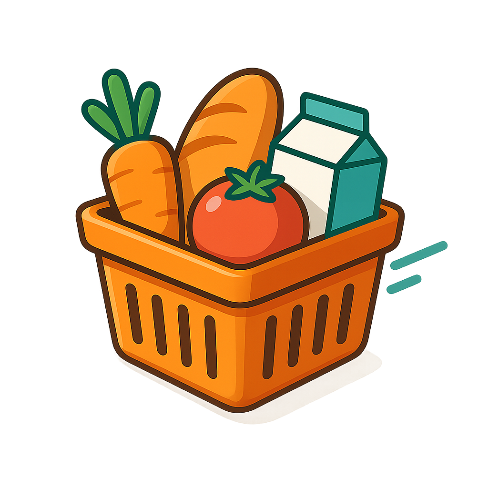
  
  **A modern, responsive online grocery shopping platform built with React and Tailwind CSS**
  
  [](https://reactjs.org/)
  [](https://vitejs.dev/)
  [](https://tailwindcss.com/)
  [](https://reactrouter.com/)
</div>

## 📸 Screenshots

<div align="center">
  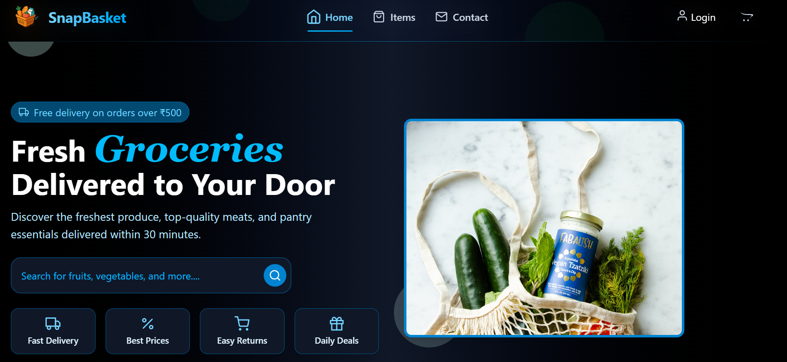
  <p><em>Fresh groceries delivered to your doorstep</em></p>
</div>

## ✨ Features

- 🏠 **Modern Home Page** - Attractive landing page with product showcase
- 🛍️ **Product Catalog** - Browse through a wide variety of grocery items
- 🛒 **Shopping Cart** - Add, remove, and manage items in your cart
- 👤 **User Authentication** - Secure login and registration system
- 📱 **Responsive Design** - Optimized for all devices and screen sizes
- 🎨 **Beautiful UI** - Clean and modern interface with Tailwind CSS
- 📞 **Contact Page** - Easy way to get in touch with customer support

## 🏗️ Project Structure

```
frontend/
├── public/
│   └── vite.svg
├── src/
│   ├── assets/          # Images and static assets
│   │   ├── logo.png
│   │   ├── FoodBanner.png
│   │   └── [100+ product images]
│   ├── components/      # Reusable UI components
│   │   ├── Navbar.jsx
│   │   ├── Footer.jsx
│   │   ├── Login.jsx
│   │   ├── Signup.jsx
│   │   ├── Item.jsx
│   │   └── ...
│   ├── pages/          # Main page components
│   │   ├── Home.jsx
│   │   ├── Items.jsx
│   │   ├── Cart.jsx
│   │   └── Contact.jsx
│   ├── App.jsx         # Main application component
│   ├── CartContext.jsx # Shopping cart state management
│   ├── main.jsx        # Application entry point
│   └── index.css       # Global styles
├── package.json
├── vite.config.js
└── tailwind.config.js
```

## 🚀 Quick Start

### Prerequisites

- Node.js (v16 or higher)
- npm or yarn package manager

### Installation

1. **Clone the repository**
   ```bash
   git clone https://github.com/kumarmanish562/SnapBasket.git
   cd SnapBasket/frontend
   ```

2. **Install dependencies**
   ```bash
   npm install
   ```

3. **Start the development server**
   ```bash
   npm run dev
   ```

4. **Open your browser**
   Navigate to `http://localhost:5173` to view the application

## 📦 Available Scripts

- `npm run dev` - Start development server
- `npm run build` - Build for production
- `npm run preview` - Preview production build
- `npm run lint` - Run ESLint for code quality

## 🛠️ Technologies Used

- **Frontend Framework:** React 19.1.0
- **Build Tool:** Vite 7.0.0
- **Styling:** Tailwind CSS 4.1.11
- **Routing:** React Router DOM 7.6.3
- **Icons:** React Icons 5.5.0
- **Linting:** ESLint
- **Development:** Hot Module Replacement (HMR)

## 🎯 Key Components

### Pages
- **Home** - Landing page with featured products and banner
- **Items** - Product catalog with filtering and search
- **Cart** - Shopping cart management (requires authentication)
- **Contact** - Contact form and support information

### Components
- **Navbar** - Navigation bar with authentication status
- **Footer** - Site footer with links and information
- **Login/Signup** - User authentication forms
- **Item** - Individual product display component
- **BannerHome** - Hero banner for the home page

## 🔐 Authentication

The application includes a complete authentication system:
- User registration and login
- Protected routes (Cart requires authentication)
- JWT token management in localStorage
- Automatic redirect to login for protected pages

## 🛒 Shopping Cart

- Add products to cart
- Update quantities
- Remove items
- Persistent cart state using React Context
- Protected access (login required)

## 🎨 Product Showcase

The application features over 100 high-quality product images including:

<div align="center">
  
  
  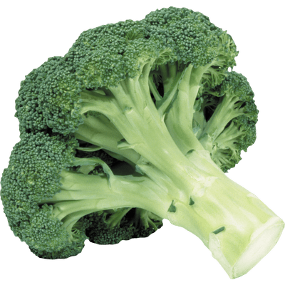
  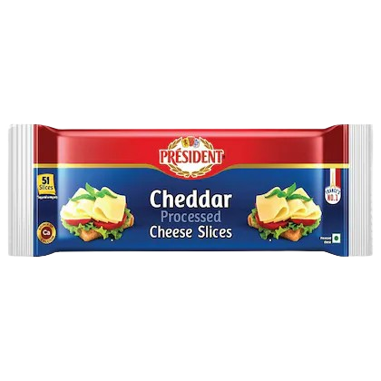
  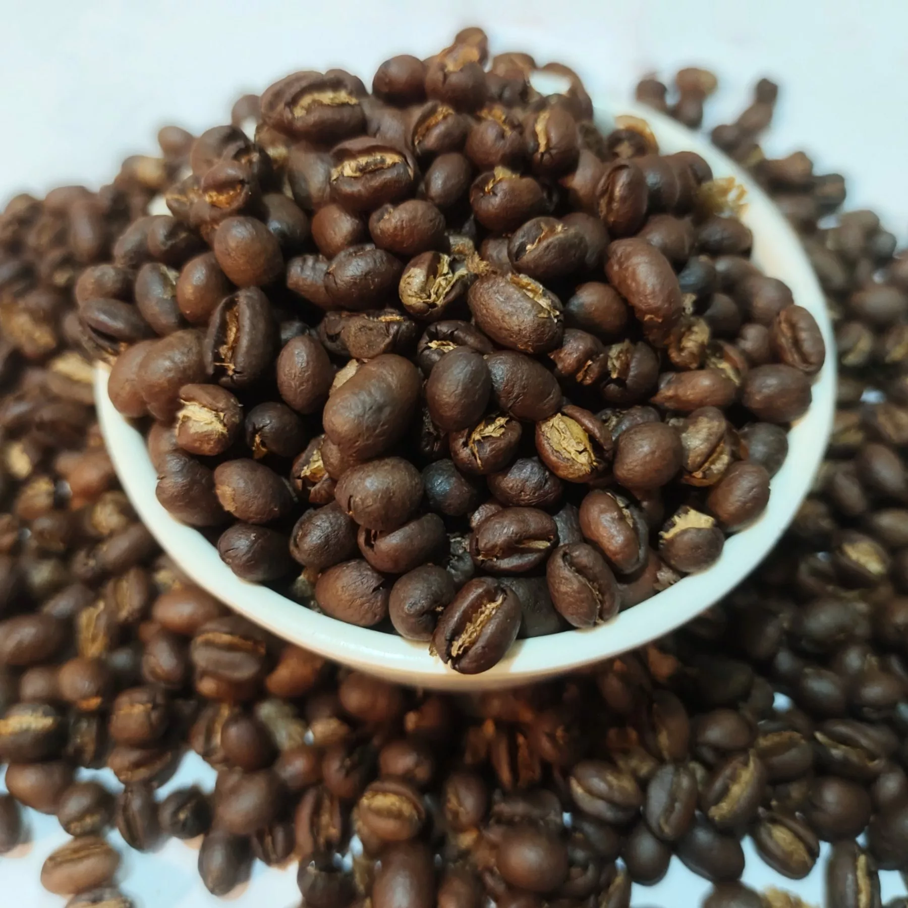
</div>

### 🌟 Featured Categories

**🍎 Fresh Fruits & Exotic Varieties**
<div align="center">
  
  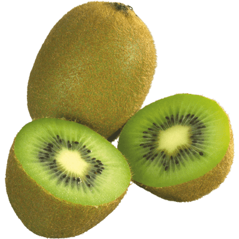
  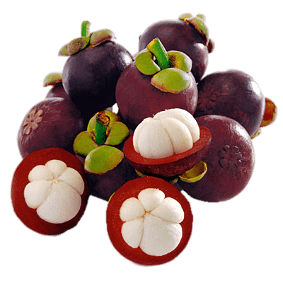
  
  
</div>

**🧀 Premium Cheeses & Dairy**
<div align="center">
  
  
  
  
  
</div>

**🍞 Artisan Breads & International Bakes**
<div align="center">
  
  
  
  
  
</div>

**🦞 Premium Seafood & Meats**
<div align="center">
  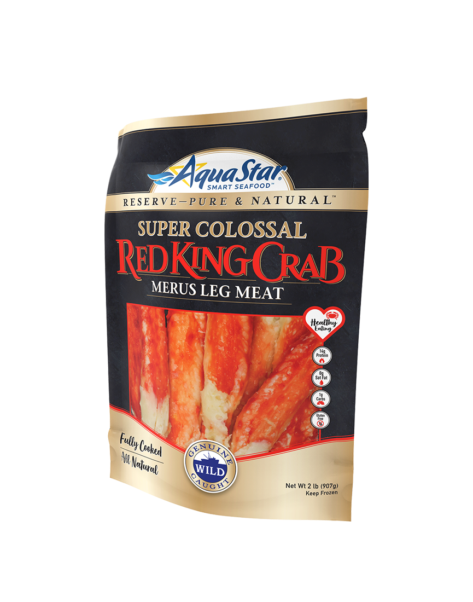
  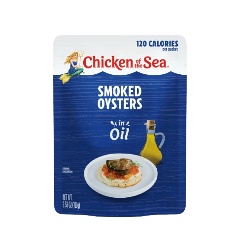
  
  
  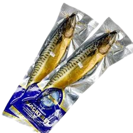
</div>

**🍫 Gourmet Treats & Confections**
<div align="center">
  
  
  
  
  
</div>

- Fresh fruits and vegetables
- Dairy products and cheeses
- Meat and seafood
- Bakery items
- Beverages and snacks
- International specialty items

## 📱 Responsive Design

The application is fully responsive and works seamlessly across:
- Desktop computers
- Tablets
- Mobile phones
- Various screen sizes and orientations

## 📞 Contact Section

Our contact page provides multiple ways to reach our customer support team:

<div align="center">
  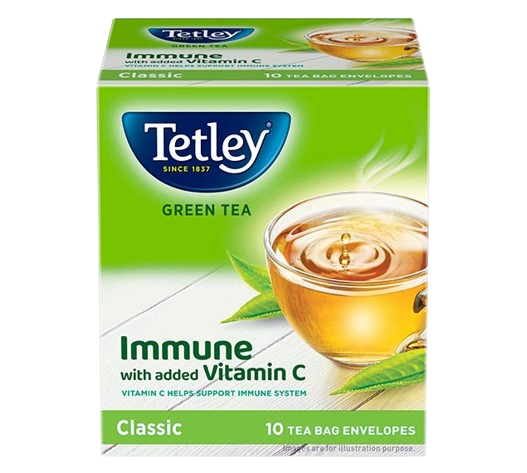
  <p><em>Friendly customer support ready to help</em></p>
</div>

**Contact Features:**
- 📧 Contact form for inquiries
- 📱 Phone support during business hours
- 🏢 Physical store locations
- ❓ FAQ section for quick answers
- 💬 Live chat support

## 🛍️ Items Catalog

Browse through our extensive collection of fresh groceries and specialty items:

<div align="center">
  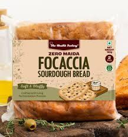
  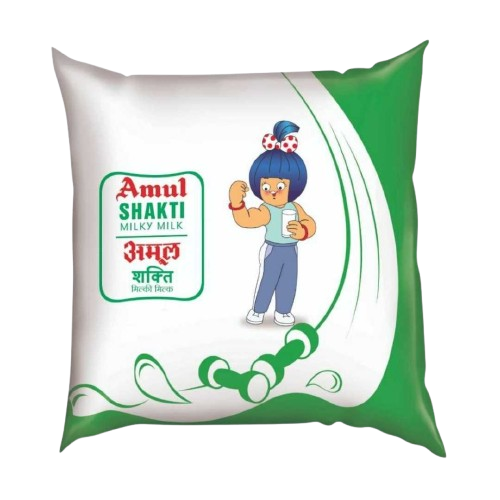
  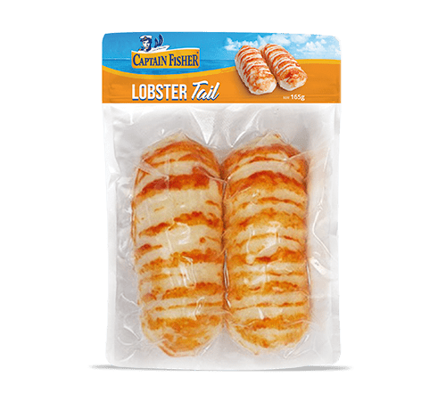
  
  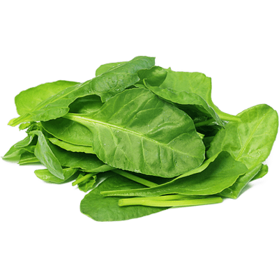
</div>

**Product Categories:**
- 🍎 **Fresh Produce** - Fruits, vegetables, and herbs
- 🥛 **Dairy & Eggs** - Milk, cheese, yogurt, and farm-fresh eggs
- 🥩 **Meat & Seafood** - Premium cuts and fresh catches
- 🍞 **Bakery** - Fresh bread, pastries, and baked goods
- 🥫 **Pantry Staples** - Canned goods, grains, and condiments
- 🍫 **Snacks & Treats** - Chocolates, nuts, and specialty items
- ☕ **Beverages** - Coffee, tea, juices, and soft drinks

## 🛒 Shopping Cart Experience

Our intuitive cart system makes shopping a breeze:

<div align="center">
  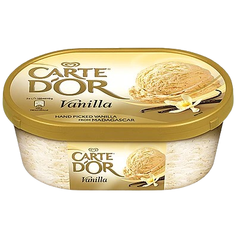
  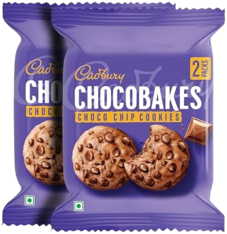
  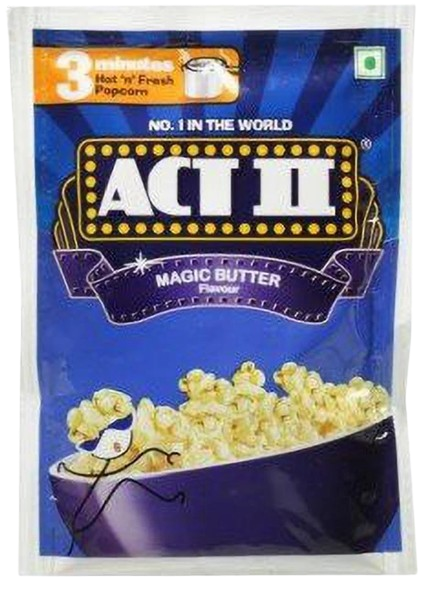
  <p><em>Easy cart management for all your favorite items</em></p>
</div>

**Cart Features:**
- ➕ **Easy Addition** - One-click add to cart from any product
- 📊 **Quantity Control** - Adjust quantities with simple +/- buttons
- 🗑️ **Remove Items** - Remove unwanted items instantly
- 💰 **Live Total** - Real-time price calculation
- 💾 **Persistent Storage** - Cart contents saved between sessions
- 🔒 **Secure Checkout** - Protected checkout process
- 📱 **Mobile Optimized** - Smooth cart experience on all devices

**Cart States:**
- Empty cart with call-to-action
- Populated cart with item management
- Loading states during updates
- Error handling for failed operations

## 🦶 Footer Information

Our footer provides essential links and company information:

<div align="center">
  
  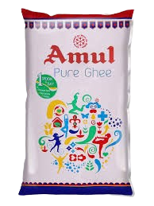
  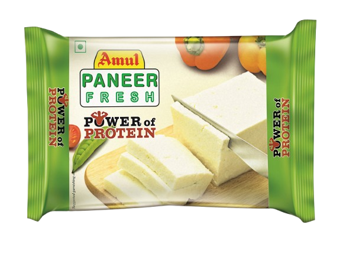
  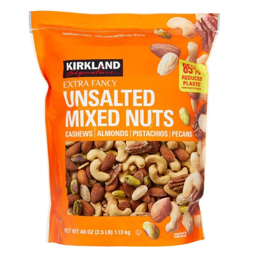
  <p><em>Quality products and customer satisfaction guaranteed</em></p>
</div>

**Footer Sections:**
- 🏪 **Company Info** - About us, our mission, and values
- 🔗 **Quick Links** - Navigation to important pages
- 📞 **Contact Details** - Phone, email, and address
- 📱 **Social Media** - Connect with us on social platforms
- 📜 **Legal** - Privacy policy, terms of service
- 🏆 **Certifications** - Quality and safety certifications
- 📧 **Newsletter** - Subscribe for deals and updates

## 🤝 Contributing

1. Fork the repository
2. Create a feature branch (`git checkout -b feature/AmazingFeature`)
3. Commit your changes (`git commit -m 'Add some AmazingFeature'`)
4. Push to the branch (`git push origin feature/AmazingFeature`)
5. Open a Pull Request

## 📝 License

This project is licensed under the MIT License - see the [LICENSE](LICENSE) file for details.

## 👨‍💻 Author

**Kumar Manish**
- GitHub: [@kumarmanish562](https://github.com/kumarmanish562)

## 🙏 Acknowledgments

- React team for the amazing framework
- Tailwind CSS for the utility-first CSS framework
- Vite for the lightning-fast build tool
- All contributors and supporters of this project

---

<div align="center">
  <p>Made with ❤️ for grocery shopping enthusiasts</p>
  
</div>